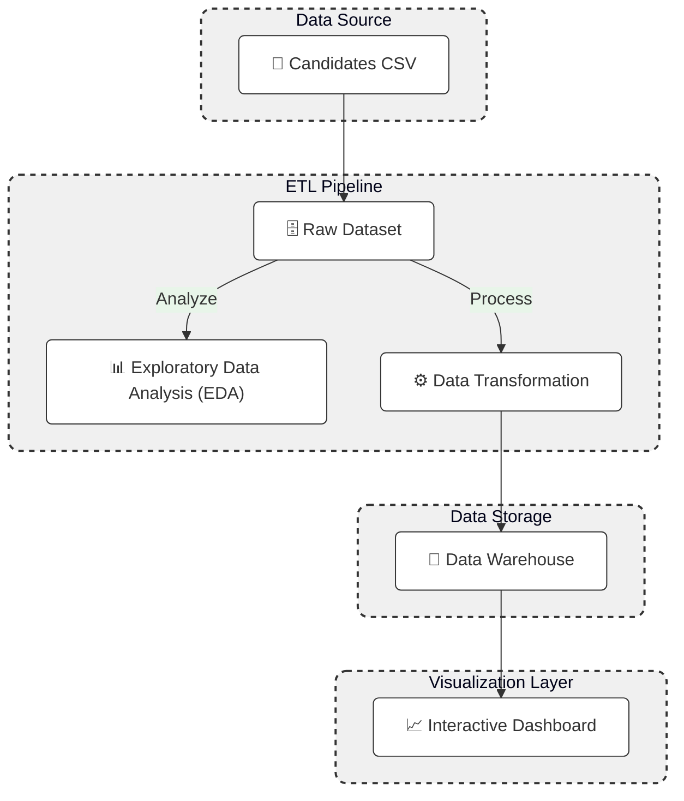

# Workshop 01: ETL System Architecture

```mermaid
%%{init: {'theme': 'base', 'themeVariables': {'primaryColor': '#E0F7FA', 'secondaryColor': '#E8F5E9', 'tertiaryColor': '#FFFDE7', 'primaryBorderColor': '#333', 'lineColor': '#333', 'fontFamily': 'arial'}}}%%
graph TD
    subgraph Data_Source["Data Source"]
        CSV["📄 Candidates CSV"]
    end

    subgraph ETL_Process["ETL Pipeline"]
        Raw["🗄️ Raw Dataset"]
        EDA["📊 Exploratory Data Analysis (EDA)"]
        Transform["⚙️ Data Transformation"]
    end

    subgraph Storage["Data Storage"]
        DW["💾 Data Warehouse"]
    end

    subgraph Visualization["Visualization Layer"]
        Dashboard["📈 Interactive Dashboard"]
    end

    CSV --> Raw
    Raw -->|Analyze| EDA
    Raw -->|Process| Transform
    Transform --> DW
    DW --> Dashboard

    classDef subgraphStyle fill:#f0f0f0,stroke:#333,stroke-width:2px,stroke-dasharray: 5 5,rx:10,ry:10
    class Data_Source,ETL_Process,Storage,Visualization subgraphStyle

    classDef nodeStyle fill:#ffffff,stroke:#333,stroke-width:1px,rx:5,ry:5
    class CSV,Raw,EDA,Transform,DW,Dashboard nodeStyle
```
