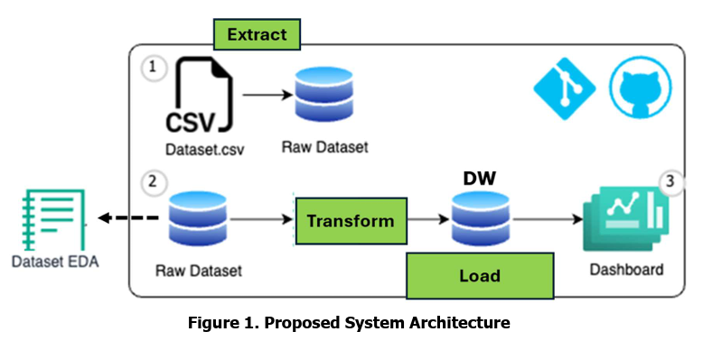
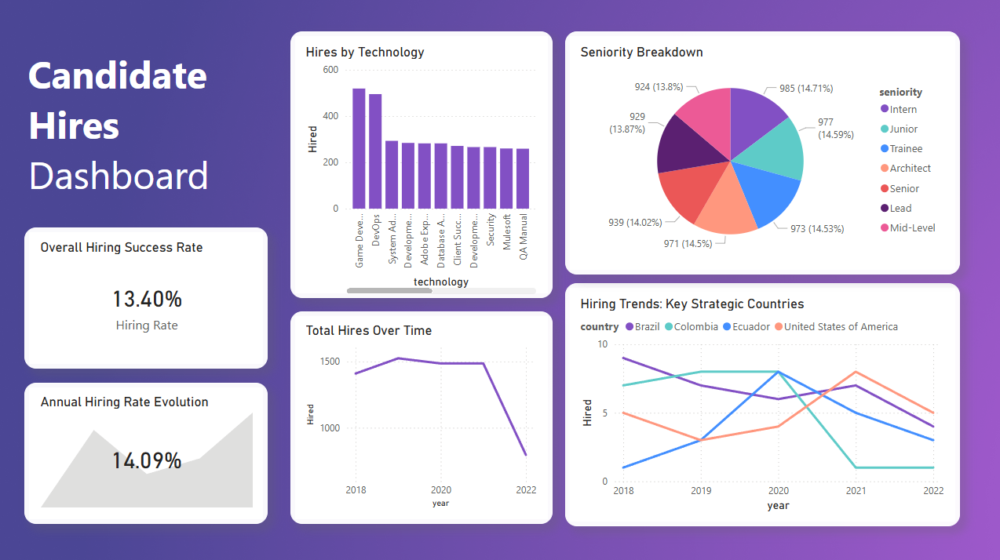

# Workshop 01: ETL System Architecture and Data Engineering

**Author:** Juan Pablo Gómez Veira  
**Course:** ETL Workshop - Data Engineering and Artificial Intelligence Undergraduate Program

---

## 1. Project Overview
This project is a complete end-to-end Extract, Transform, and Load (ETL) pipeline designed as a real-world Data Engineering technical challenge. 
The objective is to process a raw dataset of 50,000 candidate applications, clean and transform the data, apply business logic, and load it into a properly designed **Dimensional Data Model (Star Schema)** in a PostgreSQL Data Warehouse. Finally, the loaded data is used to generate analytical KPIs.

### Key Objectives
*   Extract data from raw CSV files with non-standard delimiters.
*   Perform Exploratory Data Analysis (EDA) to understand the dataset.
*   Design a robust Star Schema (Fact and Dimension tables) with Surrogate Keys.
*   Implement business logic to determine if a candidate was "Hired" based on technical and code challenge scores.
*   Load the structured data into PostgreSQL ensuring referential integrity.
*   Generate KPIs from the Data Warehouse to populate an analytical dashboard.

---

## 2. System Architecture

The ETL data flow progresses from raw ingestion to analytical consumption:



---

## 3. Dimensional Data Model (Star Schema)

To decouple the Data Warehouse from source-system natural keys and optimize for analytical queries, the data is modeled as a **Star Schema** using purely **Surrogate Keys**.


### Model Design Details:
*   **Fact Table Grain:** The grain is explicitly **one row per candidate application**, which represents the most atomic level of data in the source system. 
*   **Surrogate Keys (SK):** All primary keys (`candidate_id`, `job_id`, `location_id`, `date_id`, `application_id`) are auto-incrementing integers generated during the ETL process, no natural keys from the DB were used in the DWH dimensions.
*   **Dimensional Strategy:**
    *   **dim_jobs**: Combines `Technology` and `Seniority` into a single Job Profile dimension to simplify querying expertise.
    *   **dim_times**: Extracts the `Application Date` into Year, Month, Day, and Quarter attributes to support time-series reporting.
    *   **dim_candidates**: Stores unique candidate information (First Name, Last Name, Email). 
    *   **dim_locations**: Contains unique Countries.
*   **Measures:** The Fact table (`fact_applications`) stores the Years of Experience (YOE), technical interview scores, code challenge scores, and the computed **is_hired** flag.

---

## 4. EDA Findings & ETL Assumptions

The ETL pipeline applies the following design decisions and observations based on our Exploratory Data Analysis (EDA):

1. **High Initial Data Quality**: A key finding during the EDA phase was that the raw dataset was already exceptionally clean. There were no missing values, anomalies, or formatting errors in the core metrics. While we implemented robust type enforcement and data cleansing steps as a best practice, the dataset naturally passed these checks without needing aggressive imputation or deletion.
2. **Duplicate Handling via Composite Identity**: We discovered 167 cases where the exact same email address was shared among multiple applications. However, since the `First Name` and `Last Name` associated with those emails differed, we treated them as entirely distinct individuals. Therefore, candidates are uniquely identified by the composite combination of `(first_name, last_name, email)`. This correctly preserves all 50,000 unique applications in both the dimension and the fact tables instead of inappropriately collapsing them.
3. **Data Types & Delimiters**: The raw file `candidates.csv` uses semicolons (`;`). Columns were standardized to `snake_case` and types explicitly cast (e.g., Dates parsed to Datetime, Scores cast to Integers).
4. **Range Validation**: Constraints were enforced to drop any rows outside expected thresholds (YOE: 0-50, Scores: 0-10).
5. **Business Logic Injection**: The rule `Code Challenge Score >= 7 AND Technical Interview Score >= 7` is explicitly injected during Transformation as the `is_hired` binary flag.

---

## 5. Analytical Dashboard & KPIs

All requested KPIs and metrics were successfully computed directly from the Data Warehouse and visualized in the following dashboard:



### Tracked KPIs
To fulfill the assignment requirements, the following KPIs were extracted from the DW (visible in the dashboard and queryable via `sql/load_tables.sql`):
1. **Hires by Technology:** Showcasing the most recruited tech stacks (Game Development and DevOps).
2. **Hires by Year:** Tracking the volume of hires over time.
3. **Hires by Seniority:** Evenly distributed across all seniority levels (~14% each).
4. **Hires by Country over Years:** Focusing on USA, Brazil, Colombia, and Ecuador trends over time.
5. **Additional KPI 1 (Overall Hire Rate):** The recruitment process has a success rate of **13.40%** globally.
6. **Additional KPI 2 (Anual Hiring Evolution):** Tracking the scale of the Hiring rate evolution.

### Insights Summary 
Hiring is heavily dominated by **Game Development** and **DevOps** roles. While seniority is perfectly balanced across the board, there is a sharp decline in total hires starting in 2021/2022, which correlates to 2022 data not covering the entire year. Geographically, the USA is the most stable growth market, while Colombia and Brazil have seen drops in hiring volume over the last two years.

---

## 6. Setup Instructions

To run this project locally, you need Python and a running instance of PostgreSQL.

### Prerequisites
- Python 3.9+
- [uv](https://docs.astral.sh/uv/) (Package manager)
- PostgreSQL Server

### Installation Steps

1. **Clone the repository and install dependencies:**
   ```bash
   uv sync
   ```

2. **Database Configuration:**
   Copy the provided `.env.example` file to create your local `.env` file, and fill in your PostgreSQL credentials.
   ```bash
   cp .env.example .env
   ```
   *Note: Ensure your PostgreSQL instance is running and the specified database exists.*

3. **Run the ETL Pipeline:**
   Execute the main orchestrator script:
   ```bash
   uv run python src/main.py
   ```

4. **Verify Data Warehouse (Optional):**
   Run the verification script to verify row counts and preview the KPI calculations against your PostgreSQL DB:
   ```bash
   psql -U your_username -d your_dbname -f sql/load_tables.sql
   ```

---

## 7. Technologies & Libraries Used

| Category                | Technology                                                                                                                                       |
|-------------------------|--------------------------------------------------------------------------------------------------------------------------------------------------|
| **Language**            |                                      |
| **Database**            |                              |
| **Data Manipulation**   |   |
| **Tools**               | 
 `uv` package manager    |
*   **Libraries**: `SQLAlchemy`, `psycopg2-binary`, `python-dotenv`

---

## 8. Repository Structure
```text
etl-workshop-1/
├── data/
│   ├── processed/          # Processed data staging 
│   └── raw/
│       └── candidates.csv  # Raw source data
├── diagrams/
│   ├── README.md           # Schema design details and explanations
│   └── star_schema.png     # Star schema visualization
├── docs/
│   ├── assignment.md       # Original workshop requirements
│   └── images/
│       ├── dashboard.png          # Final analytical dashboard
│       └── system_architecture.png # System architecture diagram
├── logs/
│   ├── .gitkeep            # Ensures the logs directory is tracked
│   └── etl.log             # Generated during pipeline execution (ignored in git)
├── notebooks/
│   ├── eda.ipynb           # Exploratory Data Analysis
│   └── prototype.ipynb     # Initial ETL prototype logic
├── sql/
│   ├── create_tables.sql   # DDL for Star Schema creation
│   └── load_tables.sql     # Verification queries & KPI summaries
├── src/
│   ├── extract.py          # Data extraction module
│   ├── transform.py        # Cleansing and Star Schema mapping
│   ├── load.py             # PostgreSQL loading module (via SQLAlchemy)
│   └── main.py             # ETL orchestrator
├── .env.example            # Template for PostgreSQL credentials
├── .gitignore              # Git exclusions
├── README.md               # Project documentation
├── requirements.txt        # Exported dependencies
└── uv.lock                 # Lockfile
```
