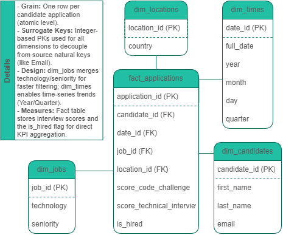

### **Model Design Details**

 

*   **Fact Table Grain:** The grain is **one row per candidate application**. This represents the most atomic level of data provided in the source system, allowing for maximum analytical flexibility.
*   **Surrogate Keys (SK):** In compliance with Data Warehousing best practices, all Primary Keys in this model are **Surrogate Keys** (integers generated during the ETL process). This decouples the Data Warehouse from source-system natural keys (like Email), ensuring referential integrity even if source data changes.
*   **Dimensional Strategy:** 
    *   **dim_jobs:** Technology and Seniority are combined into a single "Job Profile" dimension to simplify queries and improve performance when filtering by candidate expertise.
    *   **dim_times:** The application date is deconstructed into a dedicated dimension to support time-series KPIs (Yearly, Quarterly, and Monthly trends).
*   **Measures:** The Fact table stores quantitative scores and the result of the **"Hired" business logic**, enabling direct aggregation for KPI reporting.
